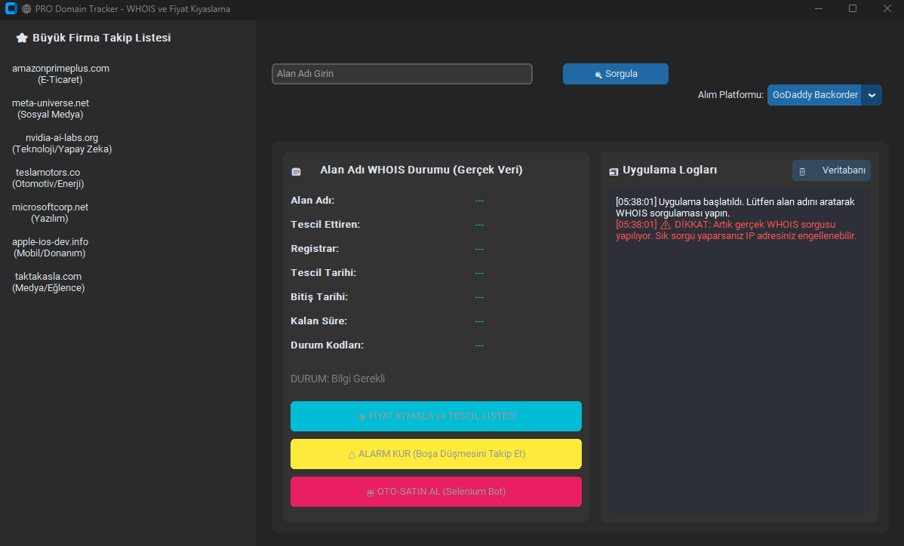

# 🌐 PRO Domain Tracker - WHOIS ve Fiyat Kıyaslama

Bu proje, alan adı (domain) müsaitliğini kontrol etmek, farklı kayıt operatörlerindeki (registrar) tescil fiyatlarını karşılaştırmak ve süresi dolmak üzere olan alan adları için takip mekanizmaları kurmak amacıyla geliştirilmiş bir masaüstü uygulamasıdır.

Uygulama, CustomTkinter kütüphanesi kullanılarak modern ve kullanıcı dostu bir arayüzle tasarlanmıştır.

 

## 🚀 Özellikler

-   **Gerçek Zamanlı WHOIS Sorgusu:** Bir alan adının dolu mu yoksa müsait mi olduğunu anında öğrenin.
-   **RDAP API Fallback:** Standart WHOIS portu (Port 43) engelliyse, sistem otomatik olarak ICANN onaylı RDAP API'sine geçiş yaparak sorguyu tamamlar.
-   **Fiyat Karşılaştırma:** Müsait bir alan adı için popüler kayıt operatörlerindeki (GoDaddy, Namecheap, Google Domains vb.) tahmini yıllık tescil fiyatlarını listeler ve en uygun seçeneği vurgular.
-   **Sorgu Geçmişi:** Yaptığınız tüm sorgular, durumları ve temel bilgileriyle birlikte yerel bir SQLite veritabanında saklanır.
-   **Popüler Domain Takibi:** Sık takip edilen büyük firmalara ait alan adlarına hızlı erişim için bir kenar çubuğu.
-   **Simüle Edilmiş Alarm Kurma:** Dolu bir alan adının boşa düşme tarihini takip etmek için (simüle edilmiş) bir alarm kurma özelliği.
-   **Simüle Edilmiş Otomatik Satın Alma Botu:** Alan adı boşa düştüğü anda otomatik olarak satın alma denemesi yapacak bir botun (simüle edilmiş) arayüz entegrasyonu.

## 🛠️ Kurulum

Projeyi yerel makinenizde çalıştırmak için aşağıdaki adımları izleyin.

1.  **Depoyu Klonlayın:**
    ```sh
    git clone https://github.com/frosworn/domain-tracker
    cd domain-tracker
    ```

2.  **Sanal Ortam Oluşturun ve Aktif Edin (Önerilir):**
    ```sh
    # Windows
    python -m venv venv
    .\venv\Scripts\activate

    # macOS / Linux
    python3 -m venv venv
    source venv/bin/activate
    ```

3.  **Gerekli Kütüphaneleri Yükleyin:**
    ```sh
    pip install -r requirements.txt
    ```

## 🏃‍♀️ Çalıştırma

Kurulum tamamlandıktan sonra uygulamayı aşağıdaki komutla başlatabilirsiniz:

```sh
python domain.py
```

## ⚠️ Önemli Notlar

-   **Fiyatlar Simülasyondur:** Fiyat karşılaştırma listesinde gösterilen ücretler, `PLATFORM_DATA` sözlüğü içindeki aralıklara göre rastgele oluşturulmuş **tahmini** değerlerdir. Gerçek fiyatlar için ilgili platformun sitesini ziyaret edin.
-   **Alarm ve Bot Fonksiyonları:** "Alarm Kur" ve "Oto-Satın Al Botu" özellikleri şu an için **fonksiyonel değildir ve sadece simülasyon amaçlıdır**. Bu butonlar, gelecekte geliştirilebilecek gerçek bir takip ve otomatik satın alma (drop-catching) sisteminin arayüzdeki yerini göstermektedir.
-   **WHOIS Sorgu Limitleri:** Birçok WHOIS sunucusu, kısa süre içinde aynı IP adresinden gelen çok sayıda sorguyu engelleyebilir. Uygulamayı sık kullanmak, geçici olarak IP adresinizin engellenmesine neden olabilir. Uygulama bu durumu aşmak için RDAP API'sini denese de dikkatli kullanılması önerilir.
-   **Bildirimler:** Windows üzerinde masaüstü bildirimlerinin çalışması için `plyer` kütüphanesi gereklidir. Kurulumda bir sorun yaşarsanız bildirimler konsola yazdırılacaktır.

## 📦 Bağımlılıklar

-   CustomTkinter
-   python-whois
-   Requests
-   Plyer (Opsiyonel, bildirimler için)